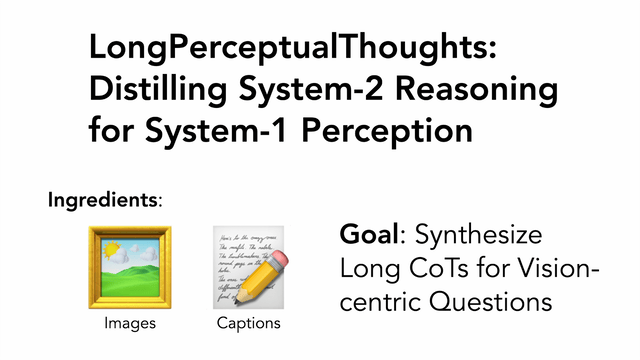

# LongPerceptualThoughts

A framework for enriching visual reasoning with long chain-of-thoughts. We introduce a synthetic dataset that distills System-2-style reasoning into System-1 visual tasks, improving perceptual grounding and transfer to language tasks.

[**paper**](https://arxiv.org/abs/2504.15362) |
[**website**](https://andrewliao11.github.io/LongPerceptualThoughts/) |
[**dataset host on Huggingface**](https://huggingface.co/datasets/andrewliao11/LongPerceptualThought) |
[**X post**](https://x.com/andrewliao11/status/1917602672493973818)



## News
- ⭐ 2025/05/26: updated LLaMA-Factory version for DPO training
- ⭐ 2025/05/23: released train and eval code 
- ⭐ 2025/05/09: released code for data generation
- ⭐ 2025/04/21: released paper and dataset

## Prerequisite
1. CUDA==11.8
2. torch==2.5.1
3. transformers>=4.51.3 (tested on 4.51.3)
4. xformers==v0.0.27.post2

## 🔧 Usage

<details>
<summary>Conda env setup</summary>

Here is the line-by-line commands to install conda environment:
<pre><code>conda create -n long_perceptual_thoughts python=3.11 -y
conda install gcc=9 gxx=9 cmake -c conda-forge -y
conda install pytorch==2.5.1 torchvision==0.20.1 pytorch-cuda=11.8  -c pytorch -c nvidia -y
pip install git+https://github.com/huggingface/transformers@b1a2de075de86564f7e635f3b31a68b5f33e4cac --no-cache-dir
conda install -c conda-forge accelerate==0.34.0 peft==0.12.0 trl==0.9.6 -y
conda install -c conda-forge fire openai pandarallel -y 
pip install xformers==v0.0.27.post2 --index-url https://download.pytorch.org/whl/cu118 --no-deps
pip install setuptools_scm tqdm pandas omegaconf datasets==3.1.0

# only for training
pip install deepspeed==0.15.4 liger-kernel matplotlib wandb

cd third_party_packages/vllm/
python use_existing_torch.py
pip install -e . --no-build-isolation -v

cd ../LLaMA-Factory
pip install -e . --no-build-isolation --no-deps -v
</code></pre>

Alternatively, you can install conda environment using the provided <code>.yml</code> file
<pre><code>conda create --name long_perceptual_thoughts --file environment.yml

pip install xformers==v0.0.27.post2 --index-url https://download.pytorch.org/whl/cu118 --no-deps
pip install setuptools_scm tqdm pandas omegaconf datasets==3.1.0

# only for training
pip install deepspeed==0.15.4 liger-kernel matplotlib wandb

cd third_party_packages/vllm/
python use_existing_torch.py
pip install -e . --no-build-isolation -v

cd ../LLaMA-Factory
pip install -e . --no-build-isolation --no-deps -v
</code></pre>

</details>

Note: Both LLaMA-Factory and vllm are actively developed open-source projecets and the code might break when there are version mismatches.


### Data synthesis

We provide a three-stage data synthesis pipeline using image-caption datasets (e.g., [google/DOCCI](https://huggingface.co/datasets/google/docci)) to generate:

- Multiple-choice questions (MCQs)
- Short chain-of-thoughts (CoTs)
- Long CoTs
The output is a JSON format compatible with LLaMA-Factory.
For details, see the data generation README at [here](./data_gen/README.md)

```bash
# Prepare DOCCI or your own dataset first
# Check the website at https://google.github.io/docci/#downloads
cd data_gen/caption_datasets/docci
wget https://storage.googleapis.com/docci/data/docci_descriptions.jsonlines
wget https://storage.googleapis.com/docci/data/docci_images.tar.gz
tar -xvf docci_images.tar.gz

cd ../../

export DISABLE_VERSION_CHECK=1
export PROJECT_ROOT="/PATH/TO/GITHUB/ROOT/"
export LLAMAFACTORY_DIR="${PROJECT_ROOT}/third_party_packages/LLaMA-Factory"
bash run_3_stages_test.sh
```

### SFT/DPO Training using LLaMA-Factory

**IMPORTANT**
Before SFT/DPO training using LLaMA-Factory, you need to register the custom dataset by modifying `LLaMA-Facotry/data/dataset_info.json`. 

Here is an example:
```json
"long_perceptual_thoughts/sft_docci_all_extended_cots": {
      "file_name": /PATH/TO/DATASET/JSON,
      "formatting": "sharegpt",
      "columns": {
            "messages": "messages",
            "images": "images",
            "assistant_prefix": "assistant_prefix"
      },
      "tags": {
            "role_tag": "role",
            "content_tag": "content",
            "user_tag": "user",
            "assistant_tag": "assistant",
            "system_tag": "system"
      }
}
```

#### Train and Evaluate

We are resource poor. We use **four A40 GPUs** (4 8GB per GPU) for training and defer the evaluation jobs by instantiate eval jobs using another instance to speedup training. More specifically, we use **4 RTX6000 GPUs** (24 GB per GPU) to perform inference and evaluation jobs. 

To disable this evaluation scheme, disable `` and `` in train config.

1. **Train jobs**
```bash
export DISABLE_VERSION_CHECK=1
llamafactory-cli train config/llama_factory_sft_train_config.yaml     # SFT training
llamafactory-cli train config/llama_factory_dpo_train_config.yaml     # DPO training
```


2. **Evaluation jobs**

By default, we evaluate on [V* bench](https://vstar-seal.github.io). Please download the images in V* Bench from [here](https://huggingface.co/datasets/craigwu/vstar_bench).

```bash
export DISABLE_VERSION_CHECK=1
export PROJECT_ROOT="/PATH/TO/GITHUB/ROOT/"
export LLAMAFACTORY_DIR="${PROJECT_ROOT}/third_party_packages/LLaMA-Factory"

cd benchmark_data/
python main.py prepare_bench
python main.py create_dataset_info

cd ../
python vllm_eval.py predict_and_eval --model_path /PATH/TO/CHECKPOINT --eval_dataset benchmark_v_star_bench --prediction_dir test/eval_sampled_greedy --temperature 0.0 --top_p 1.0 --top_k -1 --repetition_penalty 1.0 --n_samples 1 --force_thinking False --do_eval True --use_tokenized_dataset False
```


## 📚 Citation

If you find this repository helpful, please cite:

```bibtex
@misc{liao2025longperceptualthoughtsdistillingsystem2reasoning,
      title={LongPerceptualThoughts: Distilling System-2 Reasoning for System-1 Perception}, 
      author={Yuan-Hong Liao and Sven Elflein and Liu He and Laura Leal-Taixé and Yejin Choi and Sanja Fidler and David Acuna},
      year={2025},
      eprint={2504.15362},
      archivePrefix={arXiv},
      primaryClass={cs.CV},
      url={https://arxiv.org/abs/2504.15362}, 
}
```
